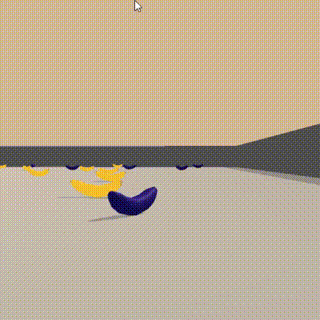

[//]: # (Image References)

# Project 1: Navigation

### Project Details
In this project an agent is trained to navigate (and collect yummy yellow bananas!) in a large, square world.  

#### Rewards
A reward of +1 is provided for collecting a yellow banana, and a reward of -1 is provided for collecting a blue banana.  Thus, the goal of your agent is to collect as many yellow bananas as possible while avoiding blue bananas.  

#### State and Action Space
The state space has 37 dimensions and contains the agent's velocity, along with ray-based perception of objects around agent's forward direction.  Given this information, the agent has to learn how to best select actions.  Four discrete actions are available, corresponding to:
- **`0`** - move forward.
- **`1`** - move backward.
- **`2`** - turn left.
- **`3`** - turn right.

#### Definition of Done
The task is episodic, and in order to solve the environment, your agent must get an average score of +13 over 100 consecutive episodes.

### Getting Started

1. Please follow the instructions in the [DRLND GitHub repository] (https://github.com/udacity/deep-reinforcement-learning#dependencies) to set up the Python environment. These instructions can be found in `README.md` at the root of the repository. By following these instructions, you will install PyTorch, the ML-Agents toolkit, and a few more Python packages required to complete the project.

(For Windows users) The ML-Agents toolkit supports Windows 10. While it might be possible to run the ML-Agents toolkit using other versions of Windows, it has not been tested on other versions. Furthermore, the ML-Agents toolkit has not been tested on a Windows VM such as Bootcamp or Parallels.

2. Download the environment from one of the links below.  You need only select the environment that matches your operating system:
    - Linux: [click here](https://s3-us-west-1.amazonaws.com/udacity-drlnd/P1/Banana/Banana_Linux.zip)
    - Mac OSX: [click here](https://s3-us-west-1.amazonaws.com/udacity-drlnd/P1/Banana/Banana.app.zip)
    - Windows (32-bit): [click here](https://s3-us-west-1.amazonaws.com/udacity-drlnd/P1/Banana/Banana_Windows_x86.zip)
    - Windows (64-bit): [click here](https://s3-us-west-1.amazonaws.com/udacity-drlnd/P1/Banana/Banana_Windows_x86_64.zip)
    
    (_For Windows users_) Check out [this link](https://support.microsoft.com/en-us/help/827218/how-to-determine-whether-a-computer-is-running-a-32-bit-version-or-64) if you need help with determining if your computer is running a 32-bit version or 64-bit version of the Windows operating system.

    (_For AWS_) If you'd like to train the agent on AWS (and have not [enabled a virtual screen](https://github.com/Unity-Technologies/ml-agents/blob/master/docs/Training-on-Amazon-Web-Service.md)), then please use [this link](https://s3-us-west-1.amazonaws.com/udacity-drlnd/P1/Banana/Banana_Linux_NoVis.zip) to obtain the environment.

3. Place the file in the DRLND GitHub repository, in the `p1_navigation/` folder, and unzip (or decompress) the file.

**Remark:** There is also an environment.yaml in the repository as I had to slightly adjust the process described above, using `pytorch=0.4.1` instead of version 0.4.0 as requested in the installation files.

### Instructions

Run the code in `Navigation.ipynb` to load the environment and train the agent. The training part can be skipped and a trained agent can be loaded and tested directly in section 5.  

### Sources and License
A lot of the source code and installation instructions is taken from the Udacity nanodegree [Deep Reinforcement Learning](https://github.com/udacity/deep-reinforcement-learning#dependencies) which is under MIT License:

>MIT License
>
>Copyright (c) 2018 Udacity
>
>Permission is hereby granted, free of charge, to any person obtaining a copy
of this software and associated documentation files (the "Software"), to deal
in the Software without restriction, including without limitation the rights
to use, copy, modify, merge, publish, distribute, sublicense, and/or sell
copies of the Software, and to permit persons to whom the Software is
furnished to do so, subject to the following conditions:
>
>The above copyright notice and this permission notice shall be included in all
copies or substantial portions of the Software.
>
>THE SOFTWARE IS PROVIDED "AS IS", WITHOUT WARRANTY OF ANY KIND, EXPRESS OR
IMPLIED, INCLUDING BUT NOT LIMITED TO THE WARRANTIES OF MERCHANTABILITY,
FITNESS FOR A PARTICULAR PURPOSE AND NONINFRINGEMENT. IN NO EVENT SHALL THE
AUTHORS OR COPYRIGHT HOLDERS BE LIABLE FOR ANY CLAIM, DAMAGES OR OTHER
LIABILITY, WHETHER IN AN ACTION OF CONTRACT, TORT OR OTHERWISE, ARISING FROM,
OUT OF OR IN CONNECTION WITH THE SOFTWARE OR THE USE OR OTHER DEALINGS IN THE
SOFTWARE.